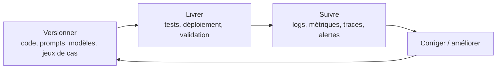

# 2. Décrire une chaîne MLOps minimale

Une chaîne MLOps minimale pour un agent IA repose sur une boucle simple : **versionner → livrer → suivre**. L’idée est de pouvoir faire évoluer l’agent sans perdre la trace de ce qui a changé, de déployer proprement une nouvelle version, puis de surveiller son comportement en production pour détecter les régressions ou la dérive.

## Versionner

Versionner, c’est garder une trace précise de tout ce qui influence le comportement de l’agent : le code, les prompts, les paramètres, les modèles, les jeux de données d’évaluation, et si possible les configurations des outils connectés. Pour un agent IA, cette étape est essentielle parce qu’un simple changement de prompt ou de contexte de récupération peut modifier fortement le résultat.

Concrètement, cela permet de savoir :

- quelle version de l’agent a été testée,
- sur quel jeu de cas,
- avec quel modèle,
- et avec quelles données de référence.

## Livrer

Livrer, c’est mettre une version validée de l’agent en environnement de test puis en production, avec une procédure claire de déploiement. Dans une chaîne minimale, la livraison doit inclure des contrôles avant mise en ligne : compatibilité technique, exécution de tests, et validation que l’agent répond bien à ses cas critiques.

Pour un agent IA, “livrer” ne veut pas seulement dire publier du code. Cela veut aussi dire déployer :

- la logique de l’agent,
- ses prompts,
- ses dépendances,
- ses connecteurs d’outils,
- et ses règles de sécurité.

## Suivre

Suivre, c’est observer l’agent une fois qu’il est en production. On collecte des traces, des métriques, des logs et des événements pour comprendre ce que fait l’agent, combien il coûte, combien de temps il prend, s’il utilise les bons outils, et s’il reste conforme aux attentes.

Le suivi sert à détecter :

- les erreurs d’outil,
- les réponses incohérentes,
- la dérive de comportement,
- les hausses de coût,
- et les problèmes de sécurité ou de conformité.

## Boucle minimale

## Pourquoi c’est important

Sans versioning, on ne sait pas expliquer pourquoi l’agent a changé. Sans livraison maîtrisée, on risque de casser le comportement validé. Sans suivi, on découvre les problèmes trop tard, uniquement par les utilisateurs ou les incidents.

## Exemple simple

Prenons un agent IA de support client. On versionne sa logique, ses prompts et son jeu de cas de test. On le livre en staging puis en production après validation. Ensuite on suit ses appels d’outils, son taux de succès, sa latence et les escalades vers un humain, pour vérifier qu’il reste utile et stable.

## Conclusion

**Une chaîne MLOps minimale pour un agent IA consiste à versionner ce qui le fait fonctionner, le livrer avec des tests et des contrôles, puis le suivre en production pour détecter la dérive et corriger rapidement.**

## Sources

1. Google Cloud, *MLOps: Continuous delivery and automation pipelines in machine learning*.
2. IBM, *Why observability is essential for AI agents*.
