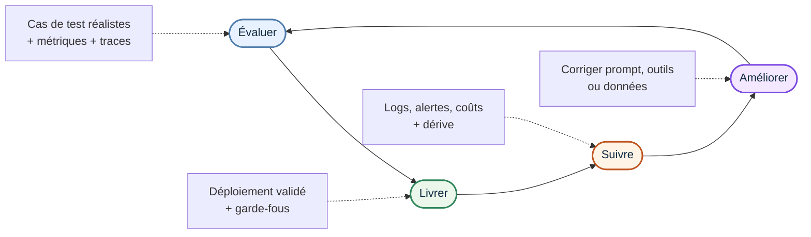

# 3. Identifier un exemple réel d’évaluation / MLOps

Un bon exemple réel est celui d’Amazon, qui explique comment elle évalue ses systèmes agentiques en production avec une approche qui couvre la qualité, le tool-use, le raisonnement, la mémoire, la sécurité et le suivi continu. L’article insiste sur le fait qu’un agent ne s’évalue pas comme un simple modèle : il faut observer le comportement du système complet, ses traces et ses interactions avec les outils.

## Pourquoi cet exemple est intéressant

- Il est industriel et concret, avec des cas d’usage réels comme l’assistant shopping, le service client et les systèmes multi-agents.
- Il montre une logique complète d’évaluation, pas seulement un benchmark isolé.
- Il relie directement l’évaluation à la production, avec monitoring, alertes, audits humains et amélioration continue.

## Ce qu’Amazon évalue

Amazon distingue plusieurs couches d’évaluation :

- Le résultat final de l’agent : correction, utilité, pertinence, concision.
- Le comportement interne : choix d’outil, paramètres, séquence d’appels, mémoire, raisonnement.
- La responsabilité : sécurité, toxicité, hallucination, respect des règles.
- La performance opérationnelle : latence, coût, robustesse sous charge.

## Exemples de métriques

L’article cite des métriques comme :

- Tool selection accuracy : mesure si l’agent choisit le bon outil.
- Tool parameter accuracy : mesure si l’agent renseigne correctement les paramètres de l’outil.
- Multi-turn function calling accuracy : mesure si l’agent enchaîne correctement plusieurs appels d’outils.
- Goal success : mesure si l’objectif final est réellement atteint.
- Context retrieval : mesure si l’agent récupère les bonnes informations utiles.
- Topic adherence : mesure si l’agent reste bien dans le sujet demandé.
- Hallucination, toxicity et harmfulness : mesurent si l’agent invente, déborde ou produit des contenus dangereux.

## Schéma de la boucle

## Lecture du schéma

- **Évaluer** : à ce moment-là, on prépare les cas de test qui ressemblent aux vraies demandes des utilisateurs, puis on observe comment l’agent agit.  
  *“je vérifie si l’agent sait résoudre un cas concret avant de le laisser partir en production.”*
  
- **Livrer** : ici, on met en production une version qui a déjà été validée.  
  *la livraison ne sert pas juste à “mettre en ligne”, mais à publier une version contrôlée, avec des garde-fous et des vérifications.*
  
- **Suivre** : une fois l’agent en service, on regarde ses logs, ses alertes et ses coûts pour voir s’il se comporte toujours comme prévu.  
  *“je surveille l’agent pour détecter une baisse de qualité, une dérive ou un coût anormal.”*
  
- **Améliorer** : si un problème apparaît, on corrige ce qui bloque, par exemple le prompt, les outils ou les données, puis on recommence la boucle.  
  *“le but n’est pas de corriger une fois, mais d’entrer dans un cycle d’amélioration continue.”*

## Ce qu’il faut retenir pour la théorie

Cet exemple montre bien que l’évaluation d’un agent IA n’est pas un événement ponctuel : c’est une boucle continue qui relie les tests, la livraison et l’observabilité. C’est exactement ce qui permet de garder un agent utile, sûr et stable dans le temps.

## Source

AWS, *Evaluating AI agents: Real-world lessons from building agentic systems at Amazon*.
